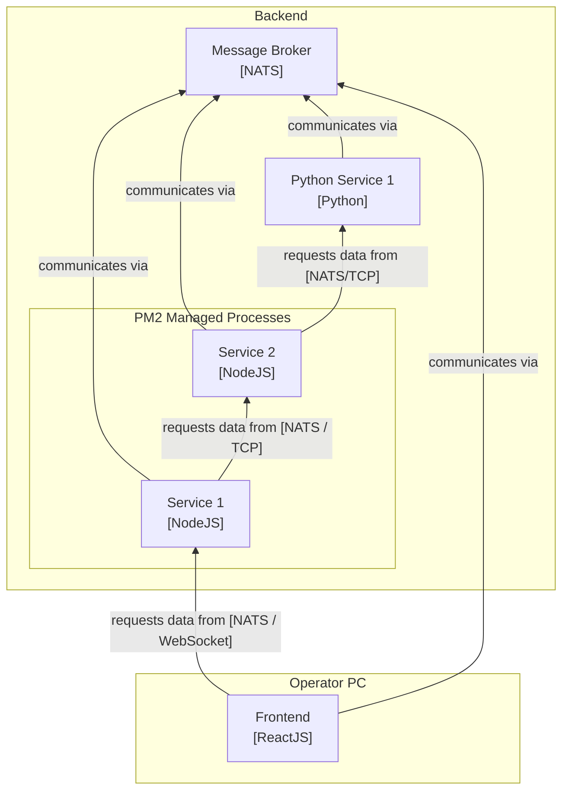
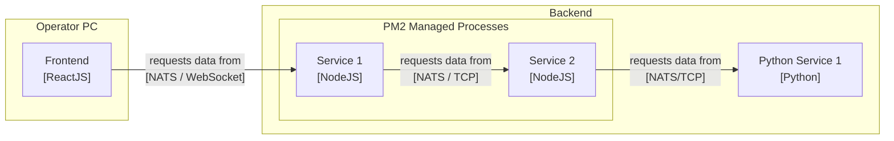

# ADR-0004: Revised Vert.x-independent terminology

Date: 2023-01-18

## Status

Proposed

## Context
<!-- The issue that is motivating this decision and any context that influences or constrains the decision. -->

Previously,  the terminology of the project was based on Vert.x' EventBus. This was a good starting point, but it is not a good fit for the project anymore.

With [ADR-0003](./0003-use-nats-as-distributed-message-bus.md), we decided to use NATS as the distributed message bus for the project. Therefore, while some aspects of Telestion can continue to use Vert.x, the terminology should be revised to be independent of Vert.x.

We have always had an ambiguity in the client/server terminology. A Verticle could both be a client to other Verticles and a server for other Verticles. This problem now only got more complicated since with NATS, the only real "server" is the NATS server itself. The NATS client libraries are only clients to the NATS server (even when used on a server-side microservice).

Given that microservices can be implemented in other languages and/or frameworks than Java/Vert.x, the term Verticle also can no longer be used to describe a microservice. Instead, it is now an implementation detail of the microservice.

## Decision
<!-- The change that we're proposing or have agreed to implement. -->

We will call the NATS server the *message broker* or *message bus* or *NATS server*.

We will call any microservice-like components that have no immediate user interface a *service* or *microservice*. We will call the collection of all services the *backend*.

We will call any components that are/provide a user interface (by themselves instead of through another component) a *frontend*.

The backend and the frontend are both parts of the *application*. The application includes all components that are deployed for a mission.

For example, an application might consist of the following components:

Because the message broker is always used (and, except for rare occurrences, at least conceptually[^ConceptualMessageBrokerSingleton] only a single message broker exists), we can omit it in our diagram to avoid visual clutter:

[^ConceptualMessageBrokerSingleton]: While there can be multiple message brokers through clustering, they are conceptually a single message broker. This is because the message broker is a singleton in the sense that there is only one message broker per application. The message broker is not a singleton in the sense that there is only one message broker per machine. This is because the message broker is a distributed system and can be scaled horizontally.

## Consequences
<!-- What becomes easier, or more difficult to do and any risks introduced by the change that will need to be mitigated? -->

The new terminology is more consistent and less ambiguous. It is also more generic and independent of Vert.x and NATS:

- The terminology is now independent of Vert.x and can be used for other frameworks and languages as well.
- The terminology is now independent of the message bus implementation and can be used for other message buses as well.
- The terminology is now independent of the deployment environment and can be used for other deployment environments as well.
- The terminology is now independent of the user interface and can be used for other user interfaces as well.
- The terminology is now independent of the programming language and can be used for other programming languages as well.

After accepting this ADR, we should update the documentation and the code to use the new terminology.

## References

- [ADR-0003](./0003-use-nats-as-distributed-message-bus.md)

